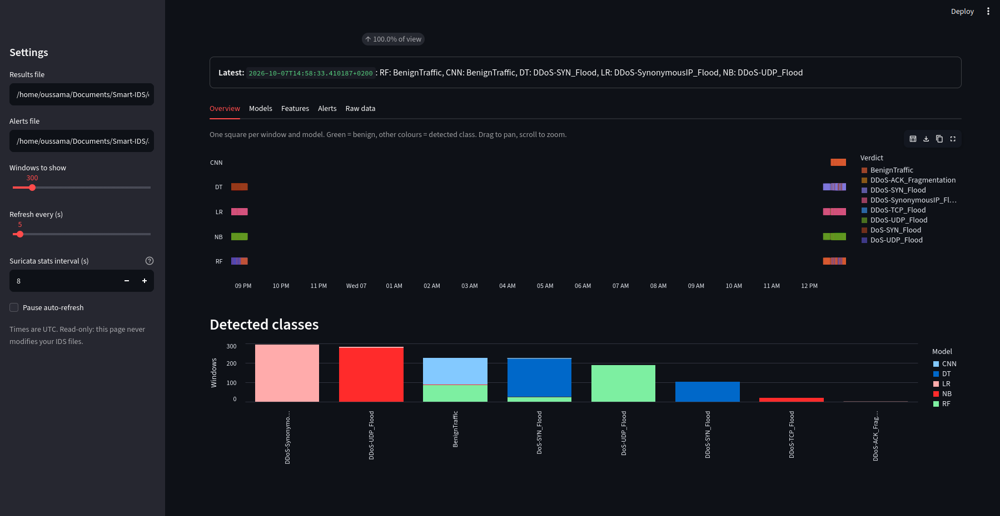

# Smart IDS — Intelligent Intrusion Detection System

Smart IDS is an AI-based Intrusion Detection System (IDS) combining **Suricata**, machine-learning models, and a **Streamlit dashboard** for detecting and monitoring malicious network traffic.

## Overview

The system processes network traffic in time-based windows, extracts relevant features, and classifies each window using multiple machine-learning models.

```text
Network Traffic
      |
      v
   Suricata
      |
      v
Feature Extraction
      |
      +-----------------------------+
      |                             |
      v                             v
Machine Learning                Alert Pipeline
      |
 +----+----+----+----+
 |    |    |    |
 RF   DT   LR   NB
 +----+----+----+----+
      |
      v
Classification Results
      |
      v
Streamlit Dashboard
```

## Main Features

- Network monitoring with **Suricata**
- Machine-learning-based intrusion detection
- Multiple classification models
- Time-window-based traffic analysis
- Malicious traffic detection
- Alert logging
- Feature inspection
- Raw-data inspection
- Interactive Streamlit dashboard

## Machine Learning Models

The project currently uses:

| Model | Abbreviation |
|---|---|
| Random Forest | RF |
| Decision Tree | DT |
| Naive Bayes | NB |

## Detected Classes

Depending on the dataset and trained models, the system can detect classes such as:

- `BenignTraffic`
- `DDoS-ACK_Fragmentation`
- `DDoS-ICMP_Flood`
- `DDoS-SynonymousIP_Flood`
- `DDoS-TCP_Flood`
- `DDoS-UDP_Flood`
- `DoS-SYN_Flood`
- `DoS-TCP_Flood`
- `DoS-UDP_Flood`

## Streamlit Dashboard

The project includes a Streamlit dashboard for real-time monitoring of the IDS results.



The dashboard provides:

- Number of windows in view
- Number of malicious windows
- Number of logged alerts
- Model errors
- Latest classification
- Prediction timeline for each model
- Distribution of detected classes

It also contains dedicated views for:

- **Overview**
- **Models**
- **Features**
- **Alerts**
- **Raw data**

### Detection Timeline

The timeline allows predictions from DT, LR, NB, and RF to be compared over time. Each segment represents a classification window.

### Detected Classes

The detected-classes chart summarizes the number of windows assigned to each traffic class, making it easier to identify dominant attack types.

## Architecture

The processing pipeline is:

```text
             Network Traffic
                    |
                    v
                Suricata
                    |
                    v
              Network Events
                    |
                    v
            Feature Extraction
                    |
                    v
          +---------+---------+
          |         |         |
          v         v         v
         RF        DT        LR        NB
          |         |         |         |
          +---------+---------+---------+
                    |
                    v
             Classification
                    |
          +---------+---------+
          |                   |
          v                   v
       Results              Alerts
          |                   |
          +---------+---------+
                    |
                    v
            Streamlit Dashboard
```

## Requirements

- Ubuntu Linux
- Python 3
- Suricata
- Pandas
- NumPy
- Scikit-learn
- Streamlit

## Installation

Clone the repository:

```bash
git clone <repository-url>
cd Smart-IDS
```

Create a virtual environment:

```bash
python3 -m venv .venv
source .venv/bin/activate
```

Install dependencies:

```bash
pip install -r requirements.txt
```

Verify Suricata:

```bash
suricata --build-info
```

Test the Suricata configuration:

```bash
sudo suricata -T -c /etc/suricata/suricata.yaml
```

## Suricata Configuration

The main configuration file is usually:

```text
/etc/suricata/suricata.yaml
```

The network capture interface and output configuration must be adapted to the environment.

Before running an experiment, verify that Suricata is receiving traffic and generating events correctly.

## Running the IDS

Start the project's detection pipeline using its main script:

```bash
python3 <main_script>.py
```

The pipeline generates result and alert files consumed by the Streamlit application.

## Running the Dashboard

Start Streamlit with:

```bash
streamlit run <streamlit_script>.py
```

Then open the local Streamlit address shown in the terminal, normally:

```text
http://localhost:8501
```

## Detection Windows

Traffic is processed in windows. For every window, each model can produce a prediction:

```text
Timestamp
   |
   +-- Random Forest
   +-- Decision Tree
   +-- Naive Bayes
```

This allows model predictions to be compared over the same period.

## Alerts

Malicious detections can be written to an alerts file. The dashboard uses these records to display:

- Alert count
- Detection timestamps
- Detected classes
- Recent malicious windows
- Model predictions

## Research Context

The project explores the combination of traditional network monitoring and machine learning for automated intrusion detection.

```text
Network Security
       |
       v
   Suricata
       |
       v
 Network Data
       |
       v
Feature Engineering
       |
       v
Machine Learning
       |
       v
Attack Detection
       |
       v
Real-Time Monitoring
```
